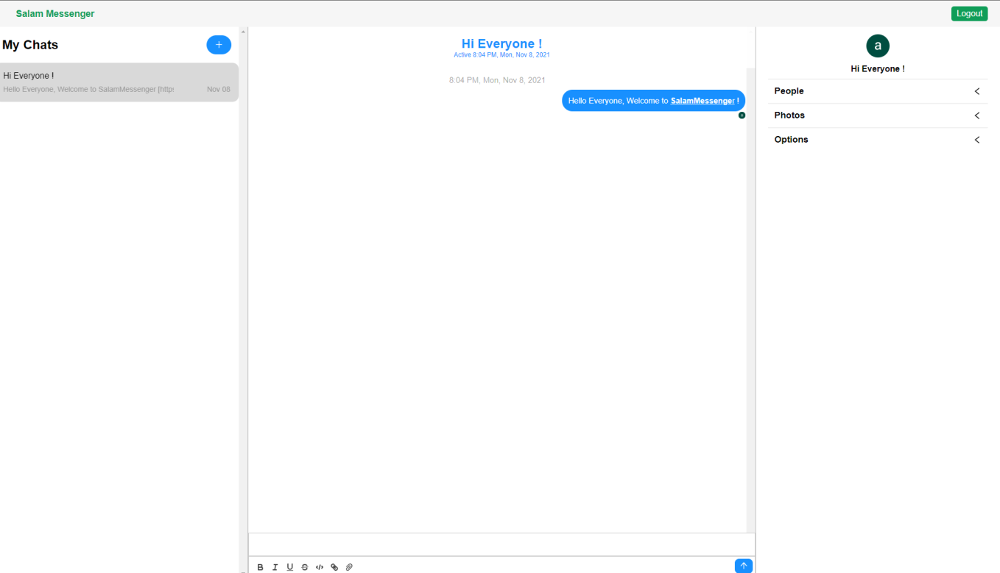

# SalamMessenger using React

<i>Using <strong>VPN/Proxy</strong> for Blocked IP required</i>

Salam Messenger delivers messages faster than any other application. Powerful. Salam Messenger has no limits on the size of your media and chats !

Simple and optimized React Messenger [( See Demo )](https://ammessenger.netlify.app/) . It includes: 

- [x] React 16.5.8
- [x] ECMAScript 6+ and JSX support
- [x] React Router v4
- [x] Code Coverage
- [x] Latest Webpack (v.4.16.5), Babel 7 and Webpack Dev Server (v.4.19.1) with Scope Hoisting enabled
- [x] ES6 linting with continuous linting on file change
- [x] SASS support
- [x] Separate CSS stylesheets generation
- [x] Automatic HTML generation
- [x] Production Config

## Starting the dev server

Make sure you have the latest Stable or LTS version of Node.js installed.

1. `git clone https://github.com/AmirhosseinAbazari/SalamMessenger`
2. Run `npm install` or `yarn install`
3. Start the dev server using `npm start`
4. Open [http://localhost:3000/](http://localhost:3000/)

## Available Commands

- `npm start` - start the dev server
- `npm clean` - delete the dist folder
- `npm run build` - create a optimized build in `build` folder

## Code Coverage

The project is using the Firebase tool. All configurations are located in `package.json`, inside the `jest` object.

The coverage report consists of an HTML reporter, which can be viewed in the browser and some helper coverage files like the coverage json file.

## About Author

<strong>Amirhossein Abazari</strong> Front-End Web Developer
